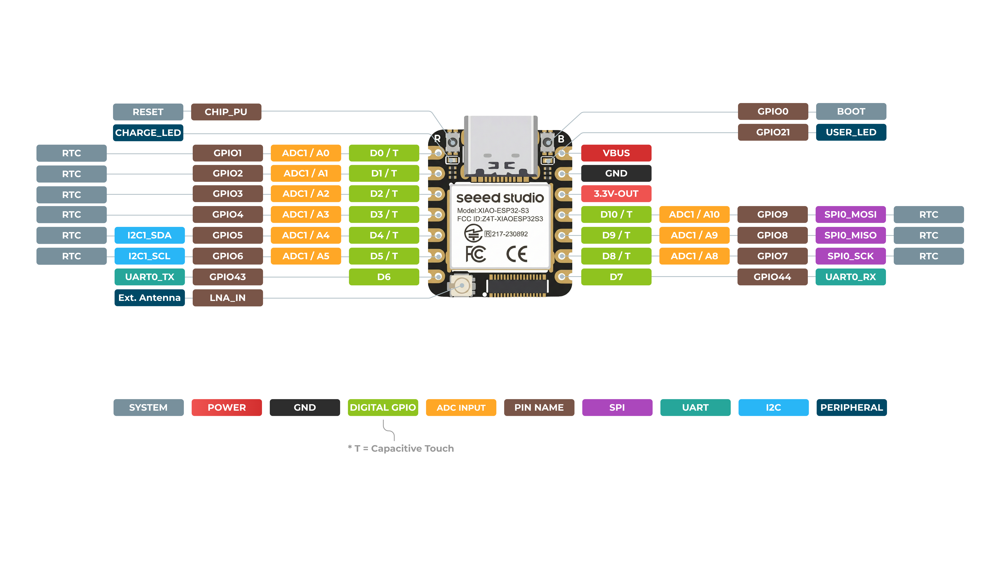
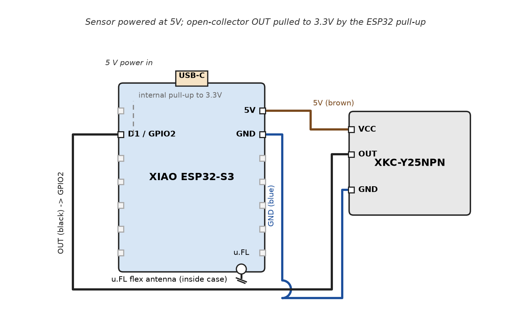
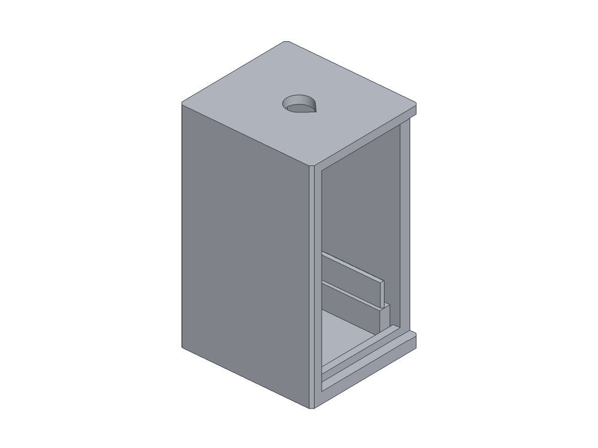
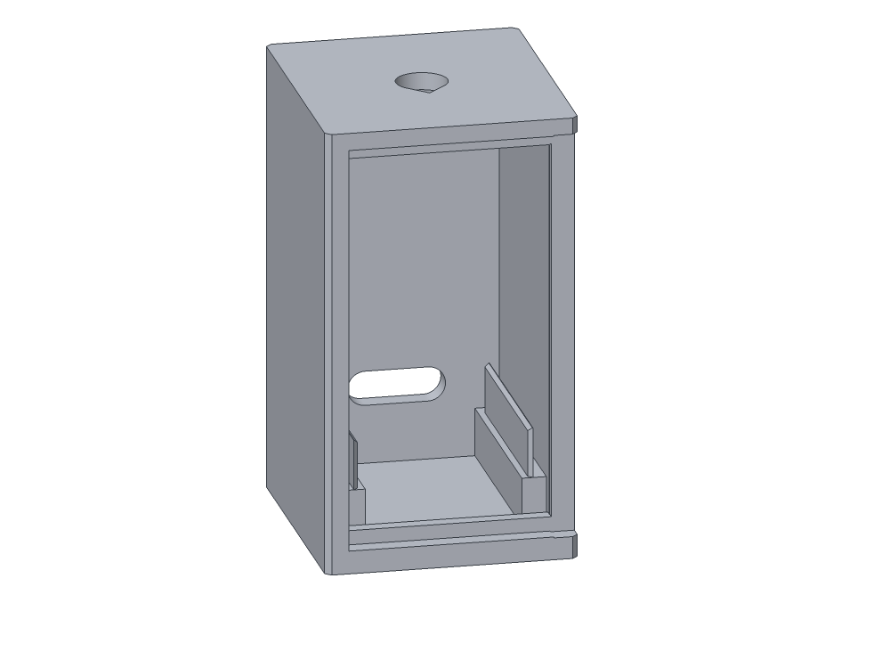
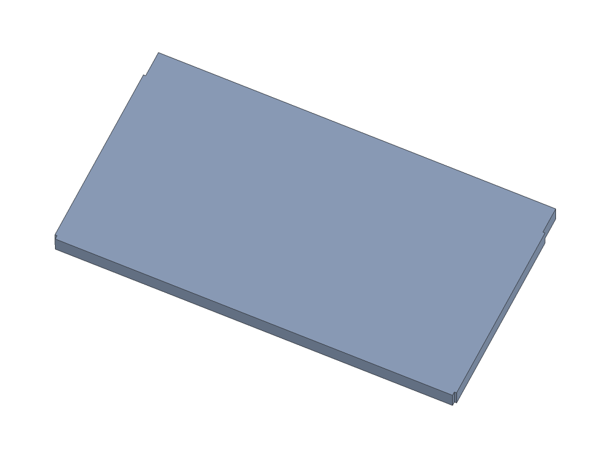

# ESP32 Tank Sensor

Non-contact liquid level sensing for a tank, exposed to Home Assistant (and voice assistants like Alexa).

## Hardware

- **MCU:** Seeed XIAO ESP32-S3 (WiFi + BLE)
- **Sensors:** 1x Pro-Range XKC-Y25NPN (capacitive, non-contact liquid level detection)

## Overview

An XKC-Y25NPN sensor mounted on the tank reports wet/dry state to the XIAO ESP32-S3. The ESP32 publishes level state to Home Assistant via ESPHome, making it controllable and automatable through Alexa and other HA-connected assistants.

## ESP32 Pinout



| Signal | XIAO ESP32-S3 pin |
|--------|-------------------|
| Water sensor (wet/dry) | GPIO2 |
| Sensor VCC | 5V |
| Sensor GND | GND |

The XKC-Y25NPN is powered from 5V but its open-collector NPN output is pulled to 3.3V by the ESP32's internal pullups — the GPIO never sees 5V.

## Circuit



Sensor cable: brown = 5V, blue = GND, black = OUT.

## Firmware (`esphome/tank-sensor.yaml`)

ESPHome config for the XIAO ESP32-S3 (`esp-idf` framework). Everything it enables:

| Feature | What it's used for |
|---------|--------------------|
| `logger` | Diagnostics over USB serial |
| `api` | Encrypted native Home Assistant integration (key in `secrets.yaml`) |
| `ota` | Wireless firmware updates from ESPHome/HA, encrypted with the same key |
| `wifi` + `captive_portal` | Joins your WiFi; if it can't, it starts a "Tank-Sensor Fallback" hotspot with a captive portal for provisioning |
| `esp32_improv` + `improv_serial` | First-boot WiFi provisioning over BLE (web.esphome.io) or USB serial — no credentials in the repo |
| `web_server` | Local web UI on port 80 for checking the sensor without HA |
| `binary_sensor` | The water sensor: GPIO2 input with internal pullup, `inverted` because the XKC-Y25NPN's NPN open-collector output is active-low; `device_class: occupancy` so it reads Detected/Clear in HA; debounced — wet must hold 100 ms to report, dry 500 ms to clear (rejects splashes/noise) |

Flash: `.venv/bin/esphome run esphome/tank-sensor.yaml` (USB) or OTA once on WiFi (`tank-sensor.local`).

## Enclosure

`case.py` (CadQuery) generates `case_body.stl` and `case_lid.stl` — a 28.8 × 25.8 × 46.4 mm
case for the XIAO ESP32-S3, with everything inside, no screws, no supports needed.
Prebuilt STL files are in `case/`.





```sh
.venv/bin/python case.py   # writes the two STL files
```

- **Board:** lies flat, USB-C facing a punch-through in one end wall (plug shell only,
  boot outside). Slides in from the open opposite end; two thin flexible rails grip its
  edges by friction along the full length. No clips or screws.
- **Cover:** the end opposite the USB port is fully open for assembly, closed by a slide
  cover held by friction ribs against the roof and floor.
- **Antenna:** the u.FL flex antenna stays inside, glued to the inner face of the slide
  cover. No pass-through hole.
- **Sensor wires:** exit through a single drop-shaped hole centered on the solid top face.

**Print:** 0.4 mm nozzle, 0.2 mm layers, PETG or ASA outdoors. Print as exported, no
supports, no scaling — the friction fits need the stated tolerances.